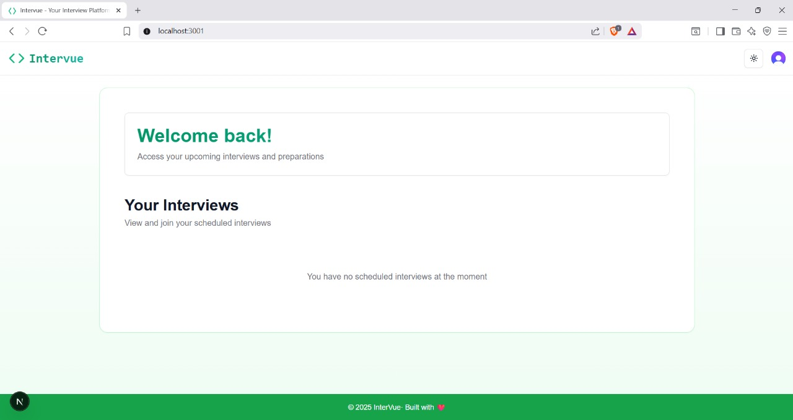
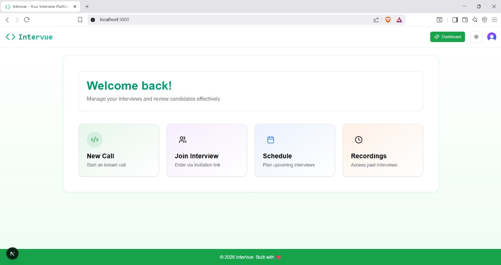
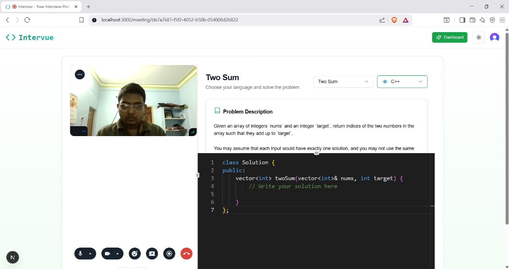
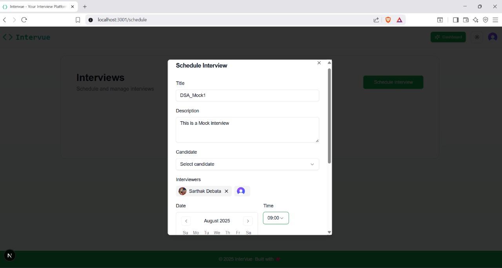
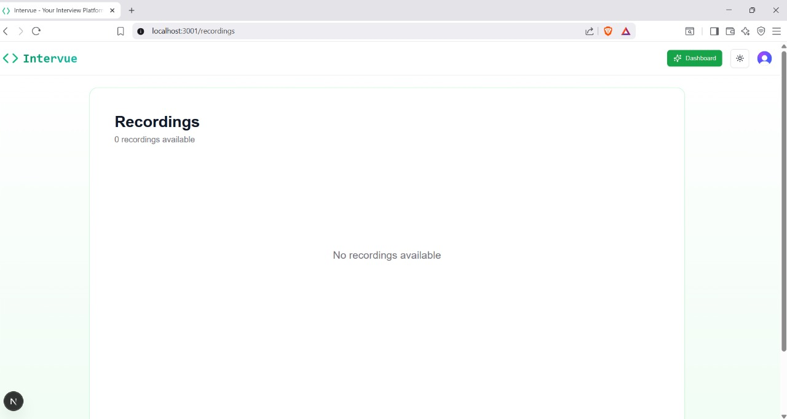

<h1 align="center">💼 InterVue – Video Interview Platform</h1>

<p align="center">
  <i>Seamless video calls, collaborative coding, screen sharing, and recording for technical interviews.</i><br/>
  Built with <b>Next.js, TypeScript, Stream, Convex, and Clerk</b>.
</p>

<p align="center">
  <a href="https://nextjs.org/"></a>
  <a href="https://www.typescriptlang.org/"></a>
  <a href="https://tailwindcss.com/"></a>
  <a href="https://clerk.com/"></a>
  <a href="#"></a>
</p>

---

## ✨ Overview
**InterVue** is a modern full-stack platform for conducting **remote technical interviews**.  
It offers a professional suite of tools including high-quality video calls, a collaborative code editor, real-time screen sharing, session recording, and secure authentication—designed for recruiters, mentors, and candidates.

---

## 🚀 Key Features
- 🎥 **Video Calls** – Smooth, real-time video conferencing powered by Stream  
- 🖥️ **Screen Sharing** – Share IDEs, presentations, or tabs seamlessly  
- 📝 **Collaborative Code Editor** – Multi-language editor for live coding sessions  
- 🎬 **Recording & Playback** – Record interviews for later review and feedback  
- 🔒 **Authentication & Authorization** – Clerk-based secure login with role-based access control (RBAC)  
- ⚡ **Full-Stack Integration** – Convex backend for scheduling, session management, and secure data handling  
- 🎨 **UI Styling** – TailwindCSS + Shadcn UI for a modern and responsive interface  
- 🏢 **Agile Development Ready** – Built with scalability, sprint workflows, and team collaboration in mind  


---

## 🖼️ Screenshots

### Candidate Login Page


### Interviewer Login Page


### Interview Session


### Schedule Interview


### Recordings Page


---
## 📄 Author Information

**Sarthak Debata**  
GitHub: [https://github.com/Gauranga025](https://github.com/Gauranga025)  
Email: debatasarthak1@gmail.com  

---

## 🛠️ Setup & Installation

### 1. Clone the Repository
```bash
git clone https://github.com/Gauranga025/Intervue.git
cd Intervue


